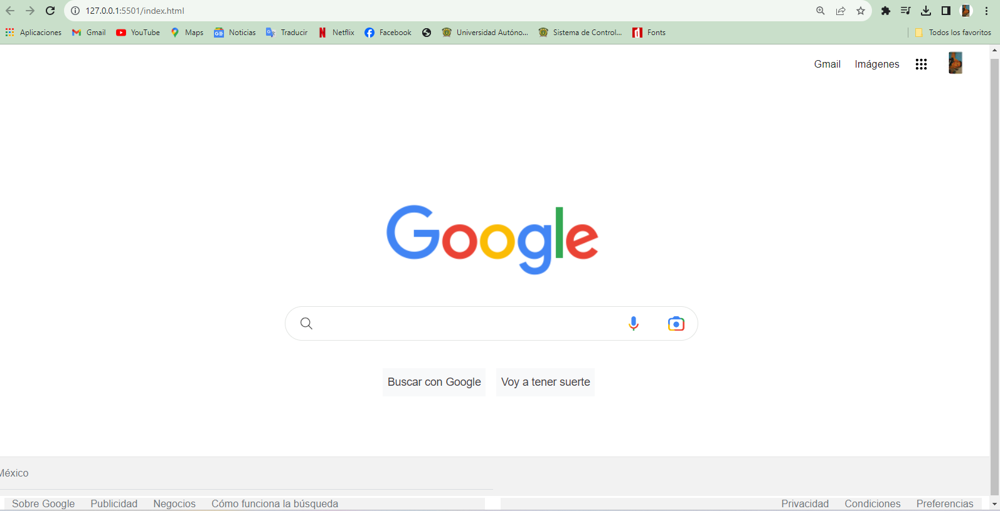

# Clon de google
Proyecto creado en **Tecnolochicas Pro** simulando la página principal del navegador de Google.
********
Poniendo en práctica lo aprendido en el bootcamp logré realizar un clin del explorador de Google.
## 1. Intro
El proyecto fue creado con **HTML y CSS**; se trata del navegador más usado: la interfaz de Google.
* Puedes visitar el sitio de el siguiente enlace 

**Insipirate de la realización de este proyecto, utiliza tu destreza para demostrar que tu futuro es ser desarrolladora fronted💪**

# Contenido del proyecto
1. Header 
Esta sección muestra el menú y foto de perfil 
2. Main
Contenedor de los elementos centrales de el buscador
3. Footer
Incluye hipervínculos al final de la página
